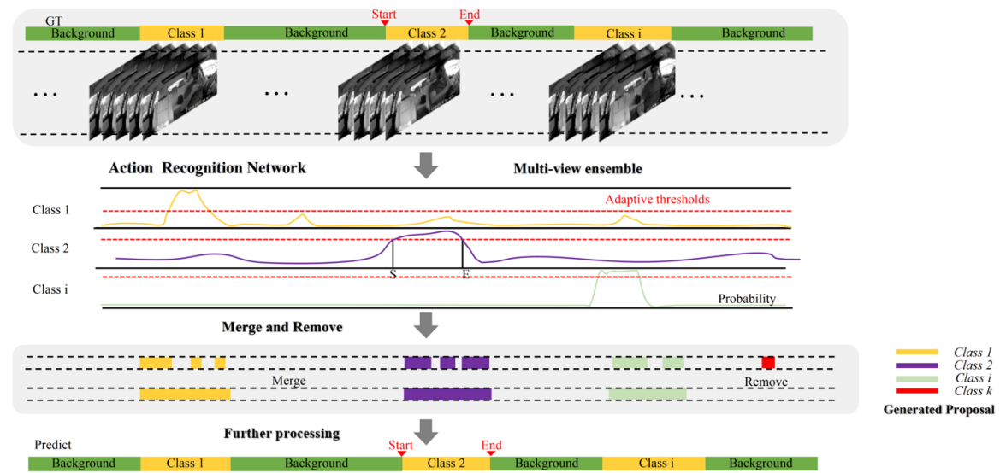

# AICITY2024_Track3
This repo includes solution for AICity2024 Challenge Track 3 -  Naturalistic Driving Action Recognition





# Getting Started

This page provides basic tutorials about the usage of our method.


<!-- TOC -->

## Datasets

The folder structure:

```
/xxxx
 / AICITY/datasets
  ├──data
    ├── A1_frame
    │   ├── VIDEO1
    │   │   ├── frame000000.jpg
    │   │   ├── frame000001.jpg
    │   │   ├── ...
    │   ├── VIDEO2
    │   │   ├── frame000000.jpg
    │   │   ├── frame000001.jpg
    │   │   ├── ...
    │   ├── ...
    ├── A2_frame
    │   ├── VIDEO1
    │   │   ├── frame000000.jpg
    │   │   ├── frame000001.jpg
    │   │   ├── ...
    │   ├── VIDEO2
    │   │   ├── frame000000.jpg
    │   │   ├── frame000001.jpg
    │   │   ├── ...
    │   ├── ...
    ├── labels
    ├── A1_x
    │   ├── user_id_xxxxx
    │   │   ├── VIDEO1.MP4
    │   │   ├── VIDEO2.MP4
    │   │   ├── ...
    │   ├── ...
    ├── ...
    ├── A2
    │   ├── user_id_xxxxx
    │   │   ├── VIDEO1.MP4
    │   │   ├── VIDEO2.MP4
    │   │   ├── ...
    │   ├── ...
    ├── video_ids.csv
 

```

## Preprocessing

```shell
# divide frame from videos and generate labels
python data_process.py 
```

## Training

```shell
# train the data set respectively in three perspectives
CUDA_VISIBLE_DEVICES=0,1,2,3 tools/dist_train.sh ./configs/Aicity/swin_base_patch244_window877_kinetics400_1k_total.py 4` --work-dir ./work_dir/train/total --validate

CUDA_VISIBLE_DEVICES=0,1,2,3 tools/dist_train.sh ./configs/Aicity/swin_base_patch244_window877_kinetics400_1k_rear.py 4 --work-dir ./work_dir/train/rear --validate

CUDA_VISIBLE_DEVICES=0,1,2,3 tools/dist_train.sh ./configs/Aicity/swin_base_patch244_window877_kinetics400_1k_dash.py 4 --work-dir ./work_dir/train/dash --validate

CUDA_VISIBLE_DEVICES=0,1,2,3 tools/dist_train.sh ./configs/Aicity/swin_base_patch244_window877_kinetics400_1k_right.py 4 --work-dir ./work_dir/train/right --validate

```

## Inference

```shell
python tools/batch_inference.py --config ./work_dir/train/rear/swin_base_patch244_window877_kinetics400_1k.py --checkpoint ./work_dir/train/rear/epoch_9.pth --video_data_root /xxxx /datasets/data/A2_frame --label ./label_map.txt --step 4 --view rear

python tools/batch_inference.py --config ./work_dir/train/dash/swin_base_patch244_window877_kinetics400_1k.py --checkpoint ./work_dir/train/dash/epoch_6.pth --video_data_root /xxxx /datasets/data/A2_frame --label ./label_map.txt --step 4 --view dash

python tools/batch_inference.py --config ./work_dir/train/right1/swin_base_patch244_window877_kinetics400_1k.py --checkpoint ./work_dir/train/right1/epoch_4.pth --video_data_root /xxxx /datasets/data/A2_frame --label ./label_map.txt --step 4 --view right
```

## Post process

```shell
python post_process.py 
python further_process.py 
Finally, the results can be seen in results_submission_process.txt.
```


## Contact
xuyuehuan, js@bupt.edu.cn

